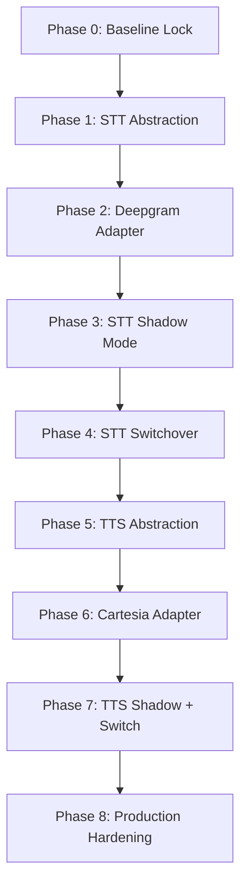

# Enterprise STT/TTS Migration Roadmap
## Deepgram Nova-2 + Cartesia Sonic — Safe Phased Integration
**Date:** May 12, 2026 | **Baseline Commit:** `c35c691`

---

## 1. Current Architecture Analysis

### Pipeline Topology
```
Browser Mic → WebSocket → VoiceLiveSource → RealEstateSTTProcessor → RealEstateLLMProcessor → RealEstateTTSProcessor → VoiceLiveSink → WebSocket → Browser Speakers
```

### Component Map

| Component | File | Role |
|:--|:--|:--|
| **STT Engine** | `stt/stt.py` | Groq Whisper REST API (batch, not streaming) |
| **STT Processor** | `flows/runtime.py:280` | Custom VAD + chunk buffering + hallucination filter |
| **TTS Engine** | `tts/tts_edge.py` | Edge-TTS (batch MP3→PCM, not streaming) |
| **TTS Processor** | `flows/runtime.py:465` | GenID tagging + cancellation + task management |
| **LLM** | `llm/llm.py` | Groq Llama-3.1-70B async |
| **State Machine** | `llm/state_manager.py` | JSON flow traversal + slot extraction |
| **Pipeline Source** | `main.py:535` | `VoiceLiveSource` — queue-based AudioRawFrame injector |
| **Pipeline Sink** | `main.py:641` | `VoiceLiveSink` — WS binary/text emitter |
| **Twilio Handler** | `telephony/twilio_handler.py` | μ-law↔PCM16 codec + TwilioSource/TwilioSink |
| **Demo Runner** | `demo_runner.py` | Simulated calls (text-only, no audio pipeline) |
| **Agent Runner** | `agent_runner.py` | Campaign orchestration (simulation + telephony) |
| **Frontend Hook** | `hooks/useVoiceSocket.js` | AudioWorklet mic capture + PCM16 playback + jitter buffer |
| **Audio Worklet** | `public/audio-worklet-processor.js` | Float32 2048-sample chunking at hardware rate |

### Audio Contract (CRITICAL — Must Remain Stable)

| Boundary | Format | Sample Rate | Encoding | Direction |
|:--|:--|:--|:--|:--|
| Browser → Backend | Raw PCM16 | Hardware rate (usually 48kHz) | Int16 LE | Mic input |
| Backend STT Input | WAV container | 16kHz | Int16 mono | After resampling |
| Backend TTS Output | Raw PCM16 | 24kHz | Int16 mono | To sink |
| Backend → Browser | Raw PCM16 | 24kHz | Int16 LE | Audio playback |
| Backend → Twilio | μ-law | 8kHz | G.711 | Telephony |
| Browser Playback | Float32 | 24kHz | AudioContext buffer | Speaker output |

### WebSocket Message Contract

| Direction | Type | Format | Purpose |
|:--|:--|:--|:--|
| Client→Server | Binary | PCM16 bytes | Mic audio |
| Client→Server | JSON | `{type:"mic_ready", sampleRate}` | Rate handshake |
| Server→Client | Binary | PCM16 bytes | TTS audio |
| Server→Client | JSON | `{type:"transcript", speaker, text}` | Live transcript |
| Server→Client | JSON | `{type:"cancel"}` | Barge-in signal |
| Server→Client | JSON | `{type:"call_*", ...}` | Dashboard events |
| Server→Client | JSON | `{type:"ping"}` | Heartbeat |

---

## 2. Previous Migration Failure Analysis

The May 7–8 attempt replaced `RealEstateSTTProcessor` and `RealEstateTTSProcessor` with Pipecat native `DeepgramSTTService` and `CartesiaTTSService` subclasses. This caused **total system failure**.

### Root Causes

| # | Failure | Root Cause | Blast Radius |
|:--|:--|:--|:--|
| 1 | **STT silence** | Deepgram expects a persistent WebSocket stream. Our processor sends chunked batch audio after VAD. The native service's internal connection lifecycle conflicted with the existing frame-by-frame push model. | All voice calls dead |
| 2 | **TTS no audio** | CartesiaTTSService produces frames at its own sample rate and format. The `generate_speech_stream()` generator contract (sync, yields PCM16 bytes) was replaced with an async frame-push model incompatible with the existing `_run_tts()` task. | All voice output dead |
| 3 | **VAD bypassed** | Native Deepgram has its own VAD. Our custom adaptive VAD (noise floor calibration, barge-in detection, `VoiceTurnState`) was entirely replaced, removing echo suppression and cooldown logic. | Feedback loops, ghost transcripts |
| 4 | **Sample rate mismatch** | Deepgram outputs at its native rate. `VoiceLiveSource` sends at browser hardware rate. The resampling boundary in `_ensure_pcm16()` was bypassed by the native service. | Garbled audio or silence |
| 5 | **GenID contract broken** | Native services don't tag frames with `gen_id`. The frontend `useVoiceSocket.js` relies on `gen_id` JSON messages to manage audio generation switching and barge-in fade-outs. | Frontend audio desync |
| 6 | **Pipeline class hierarchy** | Inheriting from `DeepgramSTTService`/`CartesiaTTSService` changed the `process_frame()` signature and internal state machine, breaking the `FrameProcessor` chain that `VoiceLiveSource`→`VoiceLiveSink` depends on. | Pipeline crash |

### Key Lesson

> **The STT and TTS processors in `runtime.py` are NOT simple wrappers.** They contain critical business logic: adaptive VAD, barge-in detection, echo suppression, GenID tagging, duplicate filtering, hallucination filtering, and `VoiceTurnState` synchronization. Replacing the class hierarchy destroyed all of this.

---

## 3. Architectural Principles for Safe Migration

1. **Swap the ENGINE, not the PROCESSOR** — Replace `stt/stt.py:transcribe_audio()` and `tts/tts_edge.py:generate_speech_stream()`, not the runtime processors
2. **Feature flags over class replacement** — Environment variables control which engine is active
3. **Shadow mode before live** — Run new providers in parallel for comparison logging
4. **Preserve all contracts** — Sample rates, PCM formats, generator signatures, frame attributes
5. **Test each boundary independently** — STT accuracy, TTS latency, WS lifecycle, DB persistence, frontend playback

---

## 4. Phased Migration Roadmap

---

### PHASE 0 — Baseline Lock & Observability (Day 1)

**Goal:** Establish stable baseline and add metrics before touching any provider code.

#### Tasks
1. Tag commit `c35c691` as `v2.0-stable-baseline`
2. Add timing instrumentation to `stt/stt.py:transcribe_audio()` — log p50/p95 latency per call
3. Add timing instrumentation to `tts/tts_edge.py:generate_speech_stream()` — log TTFB and total synthesis time
4. Add VAD event logging to `runtime.py` STT processor — log speech start/end events with timestamps
5. Create `Backend/tests/test_smoke.py` — automated check that pipeline initializes without error

#### Deliverables
- Git tag `v2.0-stable-baseline`
- Latency baseline numbers documented
- Smoke test passing

#### Rollback
- N/A — no functional changes

#### Feature Compatibility
- ✅ Demo calls: unchanged
- ✅ Real calls: unchanged
- ✅ Call results: unchanged
- ✅ Admin features: unchanged
- ✅ Client dashboard: unchanged

---

### PHASE 1 — STT Provider Abstraction (Day 2)

**Goal:** Create a pluggable STT interface WITHOUT changing the current provider.

#### Architecture
```
stt/
├── __init__.py          # exports transcribe_audio()
├── config.py            # existing config
├── stt.py               # rename to stt_groq.py
├── stt_groq.py          # current Groq Whisper (DEFAULT)
├── stt_deepgram.py      # new Deepgram adapter (PHASE 2)
└── provider.py          # NEW: factory + feature flag
```

#### Key Design: `stt/provider.py`
```python
import os
from . import config

# Feature flag: STT_PROVIDER=groq (default) | deepgram
_PROVIDER = os.getenv("STT_PROVIDER", "groq")

def transcribe_audio(audio_chunk: bytes) -> str:
    if _PROVIDER == "deepgram":
        from .stt_deepgram import transcribe_audio as _dg
        return _dg(audio_chunk)
    else:
        from .stt_groq import transcribe_audio as _groq
        return _groq(audio_chunk)
```

#### Critical Rule
- `runtime.py` continues to call `from stt.stt import transcribe_audio` — update only the import path in `stt/__init__.py`
- The function signature stays identical: `transcribe_audio(audio_chunk: bytes) -> str`
- The input contract stays identical: raw PCM16 bytes at 16kHz mono
- **Zero changes to `runtime.py`, `main.py`, or any frontend file**

#### Rollback
- Set `STT_PROVIDER=groq` in `.env` (or remove the variable entirely)

#### Feature Compatibility
- ✅ All features unchanged — this is purely structural refactoring

---

### PHASE 2 — Deepgram STT Adapter (Day 3–4)

**Goal:** Implement `stt/stt_deepgram.py` that matches the exact `transcribe_audio()` contract.

#### Design Decisions
- **Use Deepgram REST API (not WebSocket streaming)** for Phase 2. This preserves the existing batch-chunking model in `RealEstateSTTProcessor`. WebSocket streaming is a Phase 4+ optimization.
- Deepgram REST accepts WAV/PCM and returns JSON with transcript text.
- Apply the same hallucination filter from `stt_groq.py` to Deepgram output.

#### Implementation: `stt/stt_deepgram.py`
```python
def transcribe_audio(audio_chunk: bytes) -> str:
    """Drop-in replacement for Groq STT. Same signature, same contract."""
    # 1. Convert PCM16 bytes → WAV in-memory (same as stt_groq.py)
    # 2. POST to Deepgram REST API: https://api.deepgram.com/v1/listen
    #    params: model=nova-2-general, language=hi, detect_language=true
    # 3. Extract transcript text
    # 4. Apply hallucination filter
    # 5. Return clean text or ""
```

#### Testing Strategy
- Unit test: feed known Hindi/English audio samples, compare transcript quality
- Integration test: set `STT_PROVIDER=deepgram`, run a demo call, verify transcripts appear
- Comparison test: log both providers' outputs side-by-side (Phase 3)

#### Rollback
- Set `STT_PROVIDER=groq`

#### Feature Compatibility
- ✅ Demo calls: work identically (same frame flow, same text output)
- ✅ Real calls: work identically
- ✅ Call results: transcripts persist normally
- ✅ Admin/Client: completely unaffected

---

### PHASE 3 — STT Shadow Mode (Day 5)

**Goal:** Run both STT providers in parallel and compare results without affecting live flow.

#### Implementation: `stt/provider.py` shadow mode
```python
_SHADOW_MODE = os.getenv("STT_SHADOW_MODE", "false").lower() == "true"

def transcribe_audio(audio_chunk: bytes) -> str:
    # Primary provider always returns the result
    primary_text = _primary_transcribe(audio_chunk)
    
    if _SHADOW_MODE:
        try:
            shadow_text = _shadow_transcribe(audio_chunk)
            logger.info("[STT SHADOW] Primary=%s | Shadow=%s", primary_text, shadow_text)
        except Exception as e:
            logger.warning("[STT SHADOW] Shadow provider error: %s", e)
    
    return primary_text  # ALWAYS return primary
```

#### Metrics to Collect
- Transcript match rate (exact and fuzzy)
- Hindi/Marathi detection accuracy
- Latency comparison (p50, p95)
- Hallucination rate comparison

#### Rollback
- Set `STT_SHADOW_MODE=false`

#### Feature Compatibility
- ✅ All features unchanged — shadow results are logged only, never used

---

### PHASE 4 — Safe STT Switchover (Day 6–7)

**Goal:** Enable Deepgram as primary STT with per-agent feature flags.

#### Implementation
```python
# In provider.py — agent-level override
def transcribe_audio(audio_chunk: bytes, agent_id: str = "default") -> str:
    provider = _get_provider_for_agent(agent_id)
    ...

# In stt/config.py
DEEPGRAM_AGENT_IDS = os.getenv("DEEPGRAM_AGENT_IDS", "").split(",")
# Example: DEEPGRAM_AGENT_IDS=test_agent,demo_agent
```

#### Validation Checklist
- [ ] Demo call completes with transcripts
- [ ] Hindi speech recognized correctly
- [ ] Marathi speech recognized correctly
- [ ] Hinglish code-switching works
- [ ] Barge-in detection still works (VAD unchanged)
- [ ] Hallucination filter catches noise
- [ ] Call results persist to DB
- [ ] Transcript appears on frontend
- [ ] Recording includes correct user audio
- [ ] No WebSocket disconnections

#### Rollback
- Remove agent ID from `DEEPGRAM_AGENT_IDS` or set `STT_PROVIDER=groq`

#### Feature Compatibility
- ✅ Demo calls: validated per checklist
- ✅ Real calls: only if agent is in allowlist
- ✅ Call results: same schema, different transcript source
- ✅ Admin: can control via agent config
- ✅ Client dashboard: unchanged

---

### PHASE 5 — TTS Provider Abstraction (Day 8)

**Goal:** Create pluggable TTS interface, same pattern as STT.

#### Architecture
```
tts/
├── __init__.py          # exports generate_speech_stream()
├── config.py            # existing config
├── tts_edge.py          # current Edge-TTS (DEFAULT)
├── tts_cartesia.py      # new Cartesia adapter (PHASE 6)
├── provider.py          # NEW: factory + feature flag
├── response_formatter.py
└── speech_formatter.py
```

#### Key Design: `tts/provider.py`
```python
_PROVIDER = os.getenv("TTS_PROVIDER", "edge")

def generate_speech_stream(text: str, preferred_language: str | None = None):
    if _PROVIDER == "cartesia":
        from .tts_cartesia import generate_speech_stream as _cart
        return _cart(text, preferred_language)
    else:
        from .tts_edge import generate_speech_stream as _edge
        return _edge(text, preferred_language)
```

#### Critical Contract Preservation
The generator MUST yield `bytes` chunks of PCM16 audio at **24kHz mono**. This is what:
- `RealEstateTTSProcessor._run_tts()` expects
- `AudioRawFrame(audio=chunk_bytes, sample_rate=24000, num_channels=1)` requires
- `VoiceLiveSink` sends to the browser
- The frontend's `ctx.createBuffer(1, floatData.length, 24000)` decodes

#### Rollback
- Set `TTS_PROVIDER=edge`

#### Feature Compatibility
- ✅ All features unchanged — structural refactoring only

---

### PHASE 6 — Cartesia TTS Adapter (Day 9–10)

**Goal:** Implement `tts/tts_cartesia.py` matching the exact generator contract.

#### Design: True Streaming
Unlike Edge-TTS (which buffers the entire MP3 then chunks), Cartesia supports WebSocket streaming. This enables **true chunk-by-chunk yield** for dramatically lower TTFB.

#### Implementation: `tts/tts_cartesia.py`
```python
def generate_speech_stream(text: str, preferred_language: str | None = None):
    """Yields PCM16 bytes chunks at 24kHz mono. Same contract as tts_edge.py."""
    # 1. Select voice based on preferred_language (same VOICE_MAP pattern)
    # 2. Open Cartesia WebSocket connection
    # 3. Send text for synthesis
    # 4. For each audio chunk received:
    #    a. Convert to PCM16 at 24kHz if needed
    #    b. Apply fade-in on first chunk (50ms)
    #    c. yield chunk_bytes
    # 5. Apply fade-out on last chunk (50ms)
```

#### Critical: Sample Rate Alignment
Cartesia outputs at configurable rates. We MUST request **24kHz** output to match the existing contract. If Cartesia outputs at a different rate, resample before yielding.

#### Testing
- Unit test: synthesize known text, verify PCM16 format and 24kHz rate
- Latency test: measure TTFB vs Edge-TTS
- Quality test: play both outputs, compare naturalness
- Integration test: set `TTS_PROVIDER=cartesia`, run demo call

#### Rollback
- Set `TTS_PROVIDER=edge`

---

### PHASE 7 — TTS Shadow Mode + Safe Switchover (Day 11–12)

**Goal:** Compare Cartesia vs Edge-TTS, then enable Cartesia for specific agents.

#### Shadow Mode
Same pattern as STT Phase 3 — run both, log comparison metrics (TTFB, total bytes, chunk count). Primary always serves audio.

#### Gradual Enablement
```python
TTS_PROVIDER=edge                    # Global default
CARTESIA_AGENT_IDS=test_agent        # Per-agent override
```

#### Validation Checklist
- [ ] Audio plays in browser without pops/clicks
- [ ] Fade-in/fade-out applied correctly
- [ ] Barge-in cancellation works (TTS task cancelled, `VoiceTurnState` updated)
- [ ] GenID tagging preserved (`out_frame.gen_id = gen_id`)
- [ ] Frontend cancel/fade logic works
- [ ] Recording captures agent audio correctly
- [ ] Hindi voice sounds natural
- [ ] Marathi voice sounds natural
- [ ] No WebSocket disconnections during playback
- [ ] Call results duration calculation correct

#### Rollback
- Remove agent from `CARTESIA_AGENT_IDS` or set `TTS_PROVIDER=edge`

---

### PHASE 8 — Production Hardening (Day 13–15)

**Goal:** Full production deployment with monitoring and fallback.

#### Tasks
1. **Provider fallback chain**: If Deepgram fails, auto-fallback to Groq. If Cartesia fails, auto-fallback to Edge-TTS.
2. **Admin panel integration**: Add STT/TTS provider dropdown to agent creation UI
3. **Per-tenant config**: Store provider preferences in DB per agent
4. **Monitoring dashboard**: Real-time latency graphs for STT TTFB, TTS TTFB, total turn time
5. **Alerting**: Log warnings when latency exceeds thresholds

#### Final Architecture
```
stt/provider.py:  STT_PROVIDER env var → per-agent DB override → fallback chain
tts/provider.py:  TTS_PROVIDER env var → per-agent DB override → fallback chain
runtime.py:       UNCHANGED — same processors, same frame flow, same contracts
main.py:          UNCHANGED — same WS handlers, same pipeline wiring
useVoiceSocket:   UNCHANGED — same PCM16 playback, same GenID sync
```

---

## 5. Risk Matrix

| Phase | Risk | Probability | Impact | Mitigation |
|:--|:--|:--|:--|:--|
| 0 | Logging overhead | Low | Low | Sample at 1/10 rate in production |
| 1 | Import path break | Low | Medium | Verify with `python -c "from stt import transcribe_audio"` |
| 2 | Deepgram API incompatibility | Medium | Low | Isolated behind feature flag, Groq remains default |
| 3 | Shadow mode CPU overhead | Medium | Low | Run shadow in thread pool, timeout at 3s |
| 4 | Hindi accuracy regression | Medium | High | Compare shadow logs before switching; instant rollback |
| 5 | TTS import path break | Low | Medium | Same verification as Phase 1 |
| 6 | Sample rate mismatch | High | Critical | **Explicitly request 24kHz from Cartesia; verify first chunk** |
| 7 | Audio pops/clicks | Medium | Medium | Fade-in/fade-out logic; jitter buffer unchanged |
| 8 | Fallback chain latency | Low | Medium | Circuit breaker with 2s timeout per provider |

---

## 6. What Must NEVER Change

| Contract | Current Value | Why |
|:--|:--|:--|
| STT input format | PCM16 @ 16kHz mono | `_ensure_pcm16()` resamples to this; Groq/Deepgram both accept WAV |
| TTS output format | PCM16 @ 24kHz mono | Frontend `createBuffer(1, len, 24000)` hardcoded |
| TTS generator signature | `def generate_speech_stream(text, lang) -> Iterator[bytes]` | `_run_tts()` calls `_safe_next(gen)` in executor |
| STT function signature | `def transcribe_audio(chunk: bytes) -> str` | Called via `run_in_executor` in STT processor |
| GenID frame attribute | `frame.gen_id = int` | Frontend uses this for generation switching |
| WS binary format | Raw PCM16 bytes (no headers) | `useVoiceSocket.js` expects pure PCM16 |
| VoiceTurnState | `tts_active`, `tts_release_at` | Prevents echo feedback loops |
| Cancel signal | JSON `{type:"cancel"}` | Frontend fades audio + resets play queue |

---

## 7. Testing Strategy

### Per-Phase Regression Tests

| Test | What It Validates | Run When |
|:--|:--|:--|
| **Smoke test** | Pipeline initializes, StartFrame triggers greeting | Every phase |
| **Demo call E2E** | Full mic→STT→LLM→TTS→speaker round-trip | Phase 2, 4, 6, 7 |
| **Transcript persistence** | Call results appear in DB and on `/results` page | Phase 4, 7 |
| **Recording test** | WAV file created with correct stereo mix | Phase 6, 7 |
| **Barge-in test** | Speak during TTS → CancelFrame → audio stops | Phase 4, 7 |
| **Hindi/Marathi test** | Speak Hindi → correct transcript + Hindi voice response | Phase 4, 7 |
| **Admin dashboard** | Agent creation, campaign launch still work | Phase 1, 5 |
| **Twilio call test** | μ-law codec + pipeline works with new provider | Phase 4, 7 |

---

## 8. Migration Order Summary



**Total estimated timeline: 15 working days**

Each phase is independently deployable and reversible. At no point during the migration will the existing system be broken.
